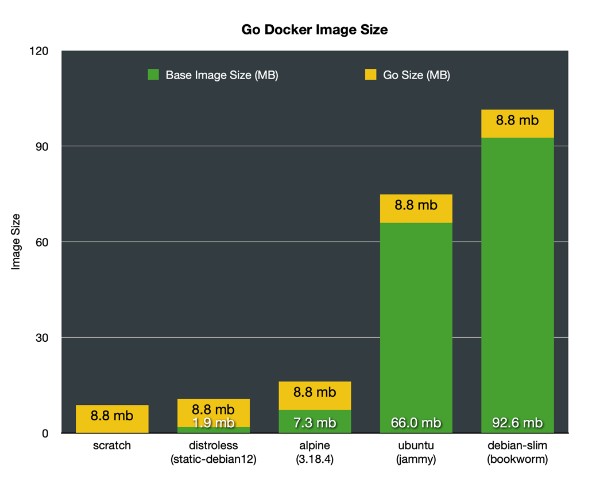

# Go-lang Docker Image Size Comparison

A comparison of Docker image sizes for a static go binary.

The go binaries are exactly the same in each image. So of course the images 
size is dictated by the base image. This illustrates that since Go is built
as a static binary, you can get the smallest image by having no base image 
at all.

Using `FROM scratch` as the base is how to get the smallest possible Docker
image.

There are two go programs:

- `serve` -- A simple webserver with only a /ping endpoint
- `healthcheck` -- A command that checks if /ping is responding.

Since `scratch` has nothing installed, including tools like `curl`, a custom
command is needed for the Docker image healthcheck.

## Related

- [Go — build a minimal docker image in just three steps](https://medium.com/@dlugos.ivan/go-build-a-minimal-docker-image-in-just-three-steps-237a7ab0a105)
- [Additional steps](https://github.com/chemidy/smallest-secured-golang-docker-image/)
  are needed if you require TLS/SSL certificates.
- [Official Docker Docs for Go-Lang images](https://docs.docker.com/language/golang/build-images/)
  uses distroless.
